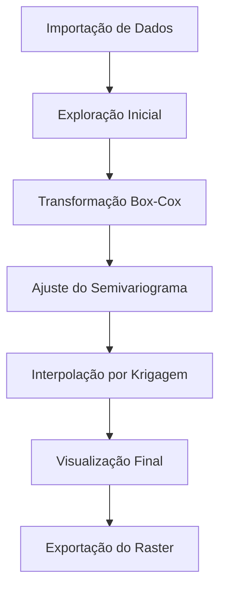

# Análise Geoestatística: Krigagem do Parâmetro Argila

Este projeto realiza uma análise geoestatística utilizando **Krigagem** para modelar e visualizar a distribuição espacial do parâmetro **Argila** em uma área específica. O projeto inclui a transformação de dados, ajuste de semivariogramas e a interpolação final por Krigagem.

## 🗂️ Estrutura do Projeto

- **imovel/**: Dados relacionados ao imóvel:
  - `area_imovel_utm.shp`: Limite do imóvel.
  - `Analise_solo_completo.shp`: Dados geoestatísticos do parâmetro **Argila**.
- **localizacao/**: Camadas adicionais de localização.
- **saida/**: Resultados gerados pelo script:
  - `histograma e bloxplot argila.png`: Histogramas e boxplots antes e depois da transformação Box-Cox.
  - `Krigagem do parâmetro Argila.png`: Resultado final da análise de Krigagem.
  - `mapa_final_layout.png`: Mapa da localização da área de estudo.
  - `pontos_analises_solo_localizacao_direita_manual.png`: Mapa com os pontos de coleta.
  - `raster_krigagem.tif`: Raster final exportado para SIGs.
  - `Semivariograma de Argila (Box-Cox).png`: Semivariograma ajustado adotado na Krigagem.

## 🚀 Como Reproduzir o Projeto

### Pré-requisitos
1. Instale o [R](https://cran.r-project.org/) e os pacotes necessários:
   ```R
   install.packages(c("sf", "dplyr", "psych", "ggplot2", "raster", "gstat", "MASS", "ggspatial", "gt"))
   ```

2. Certifique-se de que os dados estão organizados conforme a estrutura acima.

### Executando o Script
1. Clone o repositório:
   ```bash
   git clone https://github.com/samuel-c-santos/krigarem_r.git
   cd krigarem_r
   ```

2. Execute o script principal no R:
   ```R
   source("analise_estatistica_pH_agua.R")
   ```

### Resultados
Os resultados incluem:
- **Mapa Classificado por Krigagem**: Visualização do raster classificado.
- **Raster de Krigagem**: Arquivo GeoTIFF armazenado na pasta `saida/`.

---

## 📊 Visualizações

### Histogramas e Boxplots


### Resultado da Krigagem


### Semivariograma Ajustado


---

## 🗺️ Diagrama de Fluxo do Processo



---

## 📜 Licença
Este projeto está licenciado sob a [MIT License](LICENSE).

## ✍️ Autor
- **Samuel C. Santos** - [GitHub](https://github.com/samuel-c-santos)
