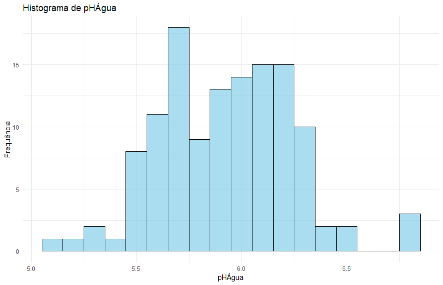
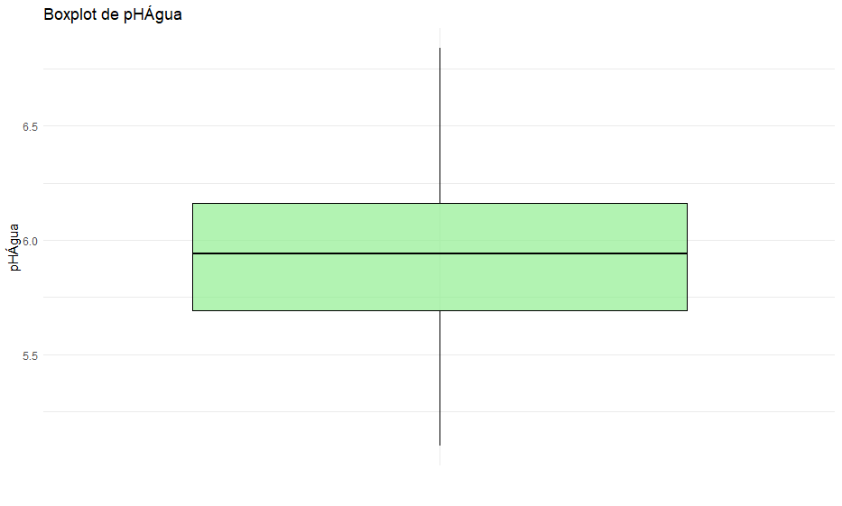
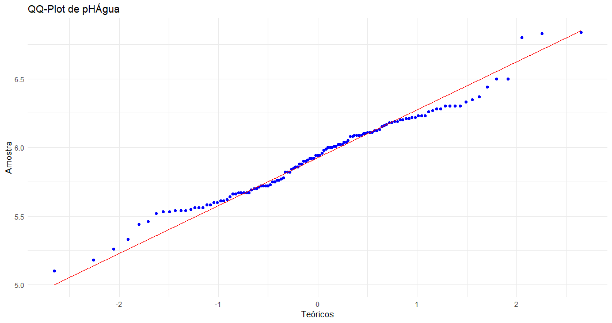
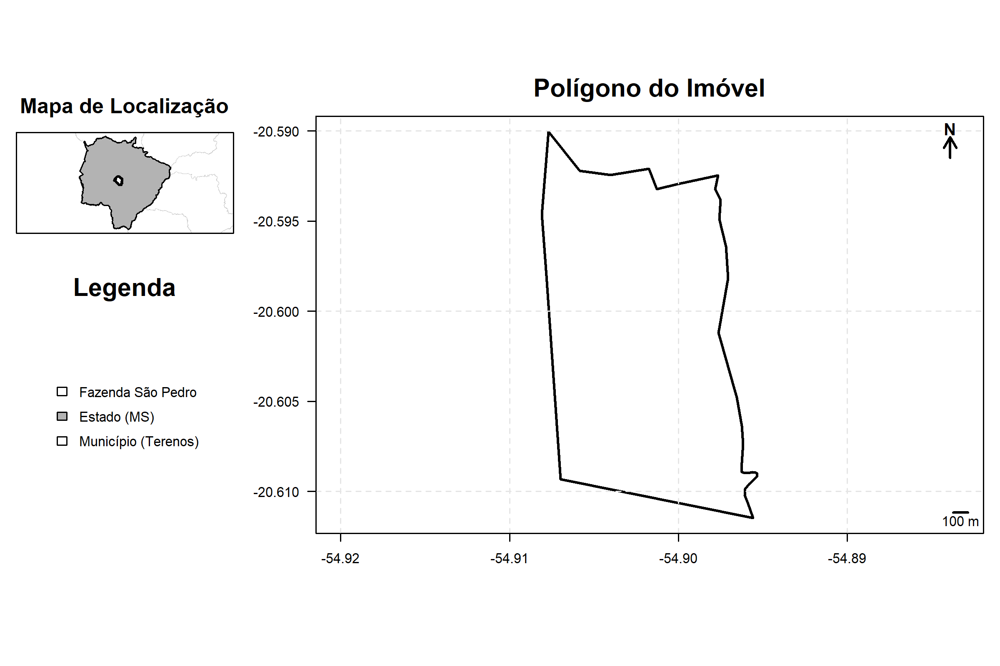
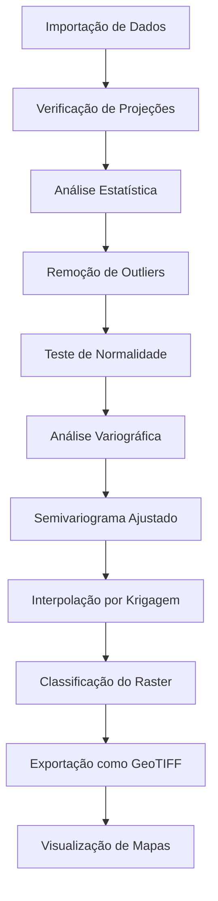

## 📂 Estrutura do Projeto

- **imovel/**: Contém os shapefiles de análise, como o limite da área e os pontos de coleta.
- **localizacao/**: Camadas geográficas adicionais para contexto, como limites municipais e estaduais.
- **saida/**: Arquivos de saída, incluindo gráficos, mapas e o raster interpolado.
- **analise_estatistica_pH_agua.R**: Script principal para análise estatística e geoestatística.

---

## 📊 Visualizações

### Histogramas e Boxplots




### Resultado da Krigagem


### Semivariograma Ajustado


### Mapa de Localização


---

## 🔄 Fluxo de Trabalho


```

### **Explicação do Diagrama**
- **A [Importação de Dados]:** Carrega os shapefiles necessários (área limite e camada de solo).
- **B [Verificação de Projeções]:** Garante que as camadas estão na mesma projeção.
- **C [Análise Estatística]:** Exploração dos dados, geração de estatísticas descritivas.
- **D [Remoção de Outliers]:** Identificação e exclusão de valores fora do padrão.
- **E [Teste de Normalidade]:** Avalia se os dados seguem uma distribuição normal.
- **F [Análise Variográfica]:** Criação do semivariograma experimental.
- **G [Semivariograma Ajustado]:** Ajuste do modelo teórico esférico ao semivariograma.
- **H [Interpolação por Krigagem]:** Gera um raster interpolado baseado nos valores de pHÁgua.
- **I [Classificação do Raster]:** Divide o raster em classes significativas.
- **J [Exportação como GeoTIFF]:** Salva o raster interpolado para uso em SIG.
- **K [Visualização de Mapas]:** Geração de gráficos e mapas finais.

---

### **Incluir no README.md**
1. Copie o código acima.
2. Insira na seção correspondente no `README.md`.
3. Salve e envie as alterações para o GitHub:

## 📈 Estatísticas

- **Teste de Normalidade (Shapiro-Wilk)**: Estatísticas e valor p calculados.
- **Estatísticas Descritivas**:
  - Média, Desvio Padrão, Mediana, Mínimo e Máximo.
  - Assimetria e Curtose.

---

## 🗺️ Ferramentas Utilizadas

- **Linguagem R**: Para análise estatística e geoestatística.
- **Pacotes R**:
  - `sf`: Manipulação de dados espaciais.
  - `dplyr`: Transformação de dados.
  - `ggplot2`: Visualização gráfica.
  - `gstat`: Análise variográfica e krigagem.
  - `raster`: Manipulação de rasters.

---

## 📜 Licença